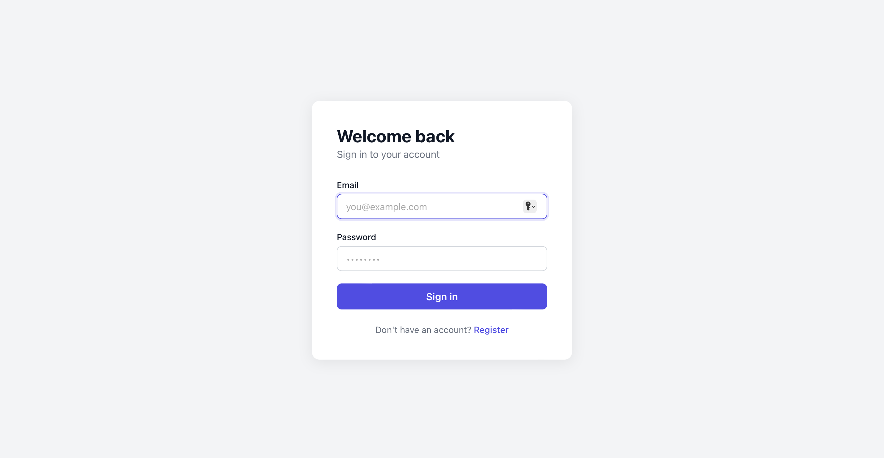

# Spring Boot Angular Auth

A full-stack user authentication demo. Implements a complete login and registration flow with JWT-based authentication.

---

## Tech Stack

### Backend
- **Java 21**
- **Spring Boot 3** — application framework
- **Spring Security 6** — authentication and authorization
- **Spring Data JPA** — database access layer
- **PostgreSQL** — relational database
- **JWT** — JWT token generation and validation
- **Lombok** — boilerplate reduction
- **Maven** — build tool

### Frontend
- **Angular 21** — frontend framework
- **SCSS / SASS** — styling
- **Reactive Forms** — form handling and validation
- **Angular HTTP Client** — API communication
- **JWT Interceptor** — automatic token attachment on requests

---

## Project Structure

```
spring-boot-angular-auth/
├── backend/                  # Spring Boot application
│   ├── src/
│   │   └── main/java/com/example/springBootAngularAuth/
│   │       ├── controller/   # REST endpoints
│   │       ├── dto/          # Data transfer objects
│   │       ├── model/        # JPA entities
│   │       ├── repository/   # Database access
│   │       ├── security/     # JWT filter, config, service
│   │       └── service/      # Business logic
│   └── pom.xml
├── frontend/                 # Angular application
│   └── src/app/
│       ├── auth/
│       │   ├── guards/       # Route protection
│       │   ├── interceptors/ # JWT attachment
│       │   ├── services/     # Auth API calls
│       │   ├── login/        # Login component
│       │   └── register/     # Register component
│       └── dashboard/        # Protected route
└── README.md
```

---

## API Endpoints

| Method | Endpoint              | Access    | Description          |
|--------|-----------------------|-----------|----------------------|
| POST   | /api/auth/register    | Public    | Register a new user  |
| POST   | /api/auth/login       | Public    | Login, returns JWT   |

---

## Running Without Docker

### Prerequisites

Make sure the following are installed on your machine:

- [Java 21+](https://adoptium.net/)
- [Maven 3.9+](https://maven.apache.org/download.cgi)
- [Node.js 22+](https://nodejs.org/)
- [PostgreSQL 16+](https://www.postgresql.org/download/)
- [Angular CLI 21+](https://angular.dev/tools/cli) — `npm install -g @angular/cli`

---

### 1. Set up PostgreSQL

Start PostgreSQL and create the database:

```sql
CREATE DATABASE ${db_name};
```

---

### 2. Configure the Backend

Update `backend/src/main/resources/application.yml` with your local Postgres credentials:

```yaml
spring:
  datasource:
    url: jdbc:postgresql://localhost:5432/db_name
    username: your_db_user
    password: your_db_password
  jpa:
    hibernate:
      ddl-auto: update

jwt:
  secret: your-256-bit-secret-key-here-make-it-long
  expiration: 86400000
```

---

### 3. Run the Backend

```bash
cd backend
./mvnw spring-boot:run
```

The API will be available at `http://localhost:8080`.

---

### 4. Run the Frontend

```bash
cd frontend
npm install
ng serve
```

The app will be available at `http://localhost:4200`.




---

### 5. Test the API with Postman

Import the included Postman collection `auth.postman_collection.json` to test the register and login endpoints.


---

## Authentication Flow

```
User submits login form
        │
        ▼
Angular AuthService → POST /api/auth/login
        │
        ▼
Spring validates email + password via BCrypt
        │
        ▼
JWT token generated and returned
        │
        ▼
Token stored
        │
        ▼
JWT Interceptor attaches token to all subsequent requests
        │
        ▼
Protected routes verified by Auth Guard
```